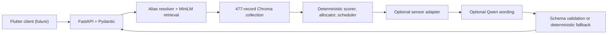

# ErgoStudy AI

ErgoStudy AI `1.0.0-prototype` is a local, posture-aware daily study planner built for a competition demonstration. It combines source-traceable semantic retrieval, deterministic study scheduling, optional normalized sensor adaptation, optional local-LLM wording, and a versioned FastAPI interface for a future Flutter client.

The prototype is complete. It is not production-ready, and this repository does not include Flutter UI implementation, deployment, Docker, authentication, cloud APIs, or raw sensor hardware integration.

## What the system demonstrates

1. A student submits available time, subjects, topics, and four 1-to-5 ratings.
2. MiniLM embeddings and a persistent Chroma collection retrieve relevant knowledge records.
3. Python rules calculate subject scores and allocate study time.
4. The scheduler creates ordered study sessions and breaks inside the available window.
5. An optional normalized sensor observation may adjust only future timing and breaks.
6. An optional local Qwen model phrases the already-complete plan in English.
7. Strict validation accepts that wording or returns a deterministic fallback.
8. FastAPI returns versioned JSON for Flutter.

## Architecture



Python owns every score, allocation, subject priority, session duration, break, sensor action, and fallback. The language model cannot change those values.

## Final evidence

- Dataset: 477 retrievable records from 29 recorded sources; 96 separate evaluation queries.
- Embedding: `sentence-transformers/all-MiniLM-L6-v2`, pinned revision, 384 dimensions.
- Frozen retrieval: Recall@5 `0.8621`, MRR@10 `0.8728`, document-family and subject-family Hit@5 `1.0000` on the sealed 32-query final split.
- End-to-end scenarios: 12 of 12 passed.
- Unit and integration tests: 171 passed.
- Warm local averages over 20 measured requests: `/plans` `113.010 ms`, `/plans/adapt` `3.893 ms`, `/plans/full` `114.440 ms`, readiness `5.045 ms`.
- Five simultaneous deterministic plan requests: 5 of 5 passed in `784.756 ms` total.
- Real prewarmed Ollama explanation: validated after one correction in `17.610 s`.

These are local prototype measurements, not production capacity claims. See [the final system report](docs/final_system_report.md) for the complete method and limitations.

## Requirements

- Windows with PowerShell
- 64-bit CPython 3.12
- Git
- A repository-local `.venv`
- Packages pinned in `requirements.txt`
- The selected MiniLM revision available in the local Hugging Face cache before offline startup
- A locally built Chroma collection
- Optional: Ollama with `qwen3:4b-instruct` already installed for live English generation

Ollama is not required for planning. The repository uses no paid service or paid API.

## Setup

From the repository root:

```powershell
py -3.12 -m venv .venv
.venv\Scripts\python.exe -m pip install --upgrade pip
.venv\Scripts\python.exe -m pip install -r requirements.txt
```

PyTorch is pinned to the CUDA 13.0 build used by the evaluated machine. On a different machine, install the appropriate PyTorch build first and then install the remaining pinned requirements. `scripts/setup_stage4_environment.ps1` preserves the original environment workflow.

Model downloads are not automatic Stage 9 behavior. Confirm before downloading models or other large files.

## Dataset validation and index build

Validate the included source and processed records:

```powershell
.venv\Scripts\python.exe scripts\validate_dataset.py
```

Build the persistent Chroma collection from the included 477-record corpus, then verify it:

```powershell
.venv\Scripts\python.exe scripts\build_chroma_index.py
.venv\Scripts\python.exe scripts\verify_chroma_index.py
```

Use `--rebuild` only when intentionally replacing the exact local collection. Chroma contents are ignored by Git and are not included in the handoff ZIP.

## Run the API

```powershell
powershell -ExecutionPolicy Bypass -File scripts\run_api.ps1
```

Local URLs:

- API base: `http://127.0.0.1:8000/api/v1`
- Interactive OpenAPI: `http://127.0.0.1:8000/docs`
- Raw OpenAPI: `http://127.0.0.1:8000/openapi.json`

## Main endpoints

| Method | Endpoint | Purpose | Calls Ollama |
| --- | --- | --- | --- |
| GET | `/api/v1/health` | Basic process health | No |
| GET | `/api/v1/readiness` | Deterministic prerequisites and separate Ollama status | Version probe only |
| POST | `/api/v1/plans` | Create a deterministic daily plan | No |
| POST | `/api/v1/plans/adapt` | Adapt an existing plan from normalized sensor data | No |
| POST | `/api/v1/plans/full` | Create and optionally adapt a plan | No |
| POST | `/api/v1/explanations` | Explain an existing plan with fallback | Yes |
| POST | `/api/v1/plans/full-with-explanation` | Slower demonstration-only full path | Yes |

Use `/plans`, `/plans/adapt`, and `/plans/full` as the primary application path. Explanation is optional.

## Run the competition demo

Verify and prewarm the already-installed local Ollama model without downloading anything:

```powershell
powershell -ExecutionPolicy Bypass -File scripts\prewarm_ollama.ps1
```

Start the prepared demonstration:

```powershell
powershell -ExecutionPolicy Bypass -File scripts\run_demo.ps1 -SkipPrewarm
```

If prewarm fails, continue normally and show the deterministic fallback. Use `-RefreshOutputs` only when intentionally rerunning the final scenarios. The 5–7 minute presentation flow and backup paths are in [the competition demo script](docs/competition_demo_script.md).

## Run validation and tests

```powershell
.venv\Scripts\python.exe scripts\final_validation.py
.venv\Scripts\python.exe -m unittest discover -s tests -v
.venv\Scripts\python.exe scripts\run_notebook_cells.py 10_end_to_end_demo.ipynb
.venv\Scripts\python.exe -m compileall -q api src scripts
git diff --check
```

`final_validation.py` preserves the 12 inputs/responses, per-scenario checks, cold/warm performance statistics, concurrent smoke, real optional Ollama result, and deterministic fallback measurements in `data/processed`.

## Build the source handoff

After checking out the final tag:

```powershell
.venv\Scripts\python.exe scripts\build_handoff_package.py
```

The ignored `handoff` directory receives the source ZIP. The ignored external `data/processed/package_manifest.json` records included count/size, exclusions, Git commit, project version, ZIP size, and SHA-256. The builder audits package entries, machine-specific paths, and common secret patterns.

## Project documentation

- [Final system report](docs/final_system_report.md)
- [Competition demo script](docs/competition_demo_script.md)
- [Discussion guide](docs/discussion_guide.md)
- [Final handoff guide](docs/final_handoff_guide.md)
- [Project file map](docs/project_file_map.md)
- [API contract](docs/api_contract.md)
- [Flutter integration guide](docs/flutter_integration_guide.md)
- [Stage reports](docs)

## Known limitations

- The corpus is curriculum-neutral and is not a course-specific tutoring dataset.
- The sealed final retrieval evaluation contains 32 queries.
- Planner and sensor thresholds are prototype product settings requiring user testing.
- Sensor input is normalized application data; raw hardware transport and calibration are not implemented.
- Sensor behavior is non-medical and must not be presented as diagnosis or treatment.
- Real Ollama latency varies and may exceed a live presentation window without prewarming.
- The local API has no authentication, TLS, rate limiting, or production hardening.
- There is no Flutter UI or deployment in this release.

The project version deliberately includes `prototype`; completion means the competition prototype and handoff are complete, not that a production service is ready.
