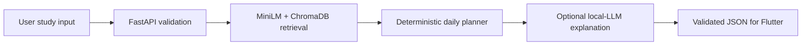

# ErgoStudy AI

ErgoStudy AI is a local personalized one-day study planner for a competition prototype. It validates student input, retrieves source-traceable guidance with cached MiniLM embeddings and ChromaDB, creates a deterministic schedule, and can optionally ask a local Ollama model to explain the completed plan in English.

The physical product still contains sensors. The hardware and Flutter teams own those sensors entirely: this AI backend does not receive, validate, store, retrieve, or act on sensor data. Users with and without the hardware receive the same AI study-planning features.

## Active flow



Python owns subject scoring, time allocation, session order, normal timer-based breaks, reasons, fallbacks, and plan IDs. The local language model only explains those values and cannot change them.

## Current evidence

- Corpus: 463 records from 23 used sources: 263 canonical records and 200 controlled aliases.
- Evaluation queries: 91 non-sensor queries with a fresh deterministic 61/30 split.
- Current 30-query evaluation: Recall@5 `0.9038`, MRR@10 `0.9274`, nDCG@10 `0.9198`, document-family Hit@5 `1.0000`, subject-family Hit@5 `1.0000`.
- Chroma collection: `ergostudy-knowledge-1-0-0`, 463 records, with IDs, documents, metadata, and manifest verified.
- Embedding: cached `sentence-transformers/all-MiniLM-L6-v2` revision `1110a243fdf4706b3f48f1d95db1a4f5529b4d41`, 384 dimensions.

These are local prototype results, not production-capacity claims.

## Inputs and outputs

Requests contain total available minutes, optional preferred start time and session length, and one or more subjects. Each subject may include topics and includes difficulty, priority, workload, and current understanding ratings from 1 to 5.

Responses contain scored subject allocations, ordered study and break sessions, study methods, deterministic reasons, warnings, unscheduled subjects, and optional grounded English wording.

## Setup

The repository expects Windows, Python 3.12, the pinned packages in `requirements.txt`, the selected MiniLM revision already in the local cache, and a locally built Chroma collection. Ollama with `qwen3:4b-instruct` is optional. No paid API is used.

```powershell
py -3.12 -m venv .venv
.venv\Scripts\python.exe -m pip install -r requirements.txt
.venv\Scripts\python.exe scripts\build_dataset.py
.venv\Scripts\python.exe scripts\validate_dataset.py
.venv\Scripts\python.exe scripts\build_chroma_index.py --rebuild
.venv\Scripts\python.exe scripts\rebuild_retrieval_evaluation.py
.venv\Scripts\python.exe scripts\verify_chroma_index.py
```

Model downloads are never automatic. Ask before downloading any model or large dataset.

## Run the API

```powershell
powershell -ExecutionPolicy Bypass -File scripts\run_api.ps1
```

Active endpoints:

| Method | Endpoint | Purpose | Waits for Ollama |
| --- | --- | --- | --- |
| GET | `/api/v1/health` | Process health | No |
| GET | `/api/v1/readiness` | Deterministic prerequisites and separate Ollama status | No |
| POST | `/api/v1/plans` | Create a deterministic daily plan | No |
| POST | `/api/v1/plans/full` | Convenience plan response | No |
| POST | `/api/v1/explanations` | Explain an existing plan with fallback | Optional |
| POST | `/api/v1/plans/full-with-explanation` | Demonstration-only combined path | Optional |

Unknown request fields are rejected. The deterministic plan endpoints never wait for Ollama.

## Validate and package

```powershell
.venv\Scripts\python.exe scripts\final_validation.py
.venv\Scripts\python.exe -m unittest discover -s tests -v
.venv\Scripts\python.exe scripts\run_notebook_cells.py 10_end_to_end_demo.ipynb
.venv\Scripts\python.exe -m compileall -q api src scripts
.venv\Scripts\python.exe scripts\build_handoff_package.py
git diff --check
```

The ignored `handoff` directory receives the source ZIP. It excludes Git data, virtual environments, caches, Chroma contents, model files, Ollama files, temporary files, and secrets.

## Limits

This is a local prototype, not a production service. It has no authentication, TLS, rate limiting, cloud deployment, Flutter UI, or course-specific tutoring corpus. Retrieval evaluation is small, and optional Ollama latency depends on the local machine.
