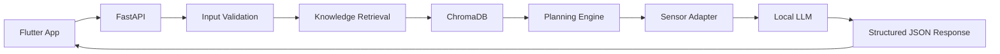

# Planned System Architecture

The diagram shows the intended end-to-end request path. These components are planned boundaries, not a claim that the system is already implemented.

In implementation, knowledge retrieval will query ChromaDB and pass relevant passages plus source metadata onward. If no sensor is present, the sensor adapter will act as a documented no-op rather than blocking the request. FastAPI will validate the final response schema before returning it to Flutter.

## Deterministic decisions

The following decisions belong to tested Python rules:

- Validation and normalization of study, time, workload, and sensor inputs.
- Subject time allocation and session ordering.
- Session durations, break placement, and daily time constraints.
- Rescheduling after completion feedback or missed sessions.
- Sensor thresholds and any resulting break or duration adjustment, once the real sensor contract is confirmed.
- Retrieval filters, response schema validation, and safety fallbacks.

These rules should produce the same result for the same normalized input and configuration. Their calculations and reasons must remain inspectable.

## Local LLM responsibilities

The local language model will turn the verified plan and retrieved passages into concise, student-friendly explanations. It may summarize source-grounded study guidance, explain why a rule was applied, and phrase optional encouragement. It must cite the supplied source metadata where factual guidance is used.

The language model will not decide time allocations, invent sensor readings or thresholds, override deterministic safety rules, or introduce unsupported educational or health claims. Its output will be accepted only after structured validation; otherwise the API will use a deterministic fallback response.
