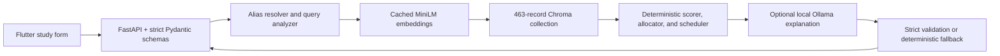

# System architecture

ErgoStudy AI is a local personalized one-day study planner.

The planner is authoritative. It uses the fixed score `0.35 × priority + 0.25 × workload + 0.20 × difficulty + 0.20 × knowledge gap`, configured session bounds, deterministic allocation, and normal timer-based breaks. The LLM cannot change numbers, subjects, order, reasons, or methods.

The physical product still has sensors, owned by hardware and Flutter teams. No sensor data crosses the API boundary or enters retrieval, planning, generation, storage, or logging. Hardware ownership does not change AI features.

Failures are bounded: invalid input returns a strict error envelope; missing knowledge uses a visible fallback; unavailable or slow Ollama returns HTTP 200 with deterministic English wording; deterministic planning never waits for Ollama.
