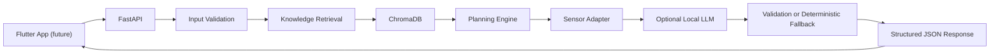

# Final prototype system architecture

The diagram shows the implemented `1.0.0-prototype` request path. Flutter is the planned client and is not implemented in this repository; every backend component shown after the client is implemented and validated locally.

Knowledge retrieval queries ChromaDB and passes relevant records and traceable metadata to the planner. If no usable sensor observation is present, the sensor adapter is a documented no-op rather than a blocker. Explanation is optional. FastAPI validates the response schema before returning JSON for a future Flutter client.

## Deterministic decisions

The following decisions belong to tested Python rules:

- Validation and normalization of study, time, workload, and sensor inputs.
- Subject time allocation and session ordering.
- Session durations, break placement, and daily time constraints.
- Rescheduling after completion feedback or missed sessions.
- Sensor thresholds and any resulting break or duration adjustment, once the real sensor contract is confirmed.
- Retrieval filters, response schema validation, and safety fallbacks.

These rules should produce the same result for the same normalized input and configuration. Their calculations and reasons must remain inspectable.

## Local LLM responsibilities

The local language model will turn the verified plan and retrieved passages into concise, student-friendly explanations. It may summarize source-grounded study guidance, explain why a rule was applied, and phrase optional encouragement. It must cite the supplied source metadata where factual guidance is used.

The language model will not decide time allocations, invent sensor readings or thresholds, override deterministic safety rules, or introduce unsupported educational or health claims. Its output will be accepted only after structured validation; otherwise the API will use a deterministic fallback response.
